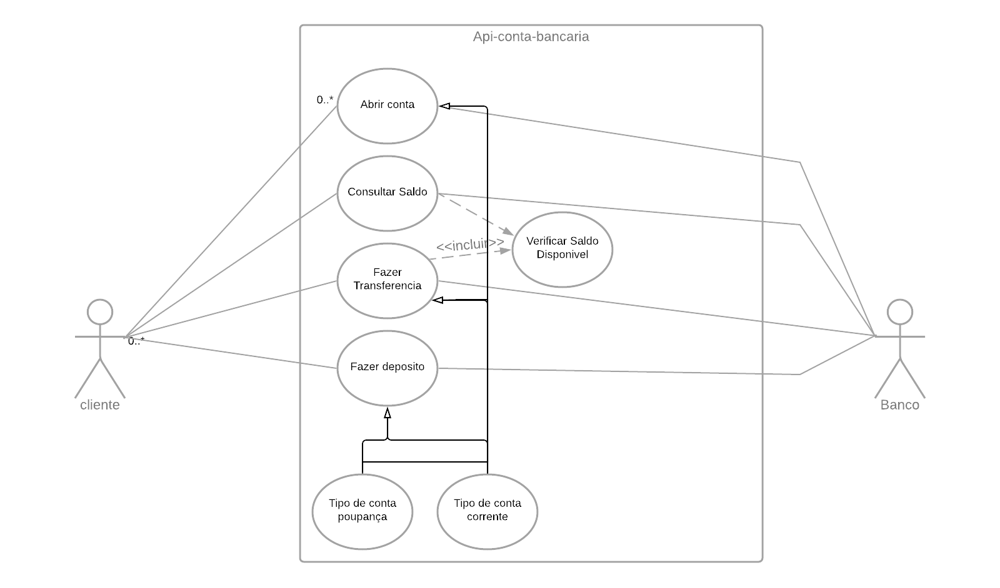

# api-conta-bancaria
* Api de conta bancária, este projeto simula contas criadas ficticiamente, para que  api seja consumida para testes ou estudos.

## A quem se destina / Objetivo
*	Este projeto é para fins de estudos.

## Resumo do projeto
* Lógica do programa 
  * Através dessa api será possivel criar uma conta ficticia, consultar o saldo, fazer transferencia e fazer depositos
## Bibliotecas e Frameworks do Projeto
* Java 11
* Spring Boot
* Spring Web
* Spring Data JPA
* Jakarta Bean Validation
* Bean Validation
* flyway Migration
* MySQL

## Diagrama

## Sobre o autor
* João Vitor
* [Linkedin](https://www.linkedin.com/in/jo%C3%A3o-vitor-ara%C3%BAjo-266572173/)
